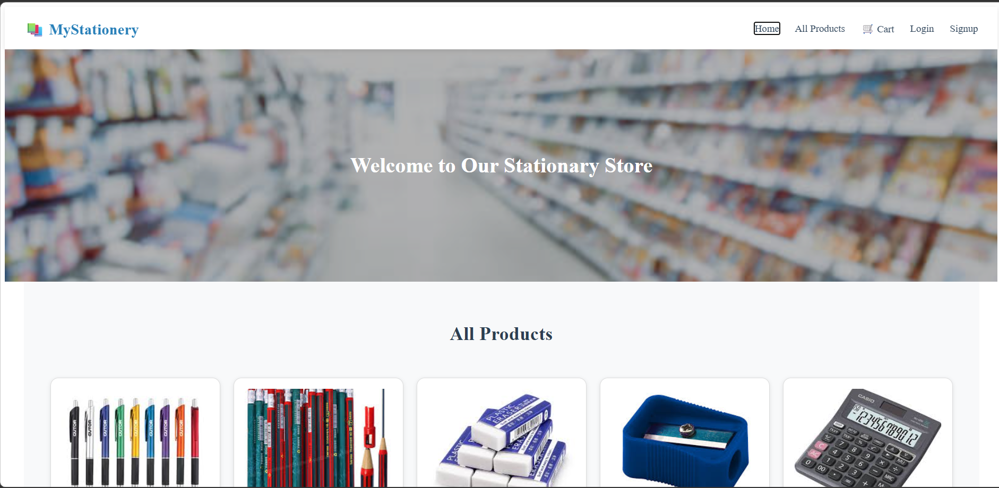
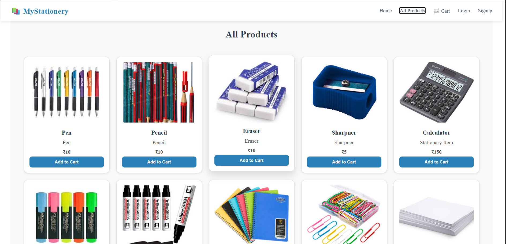
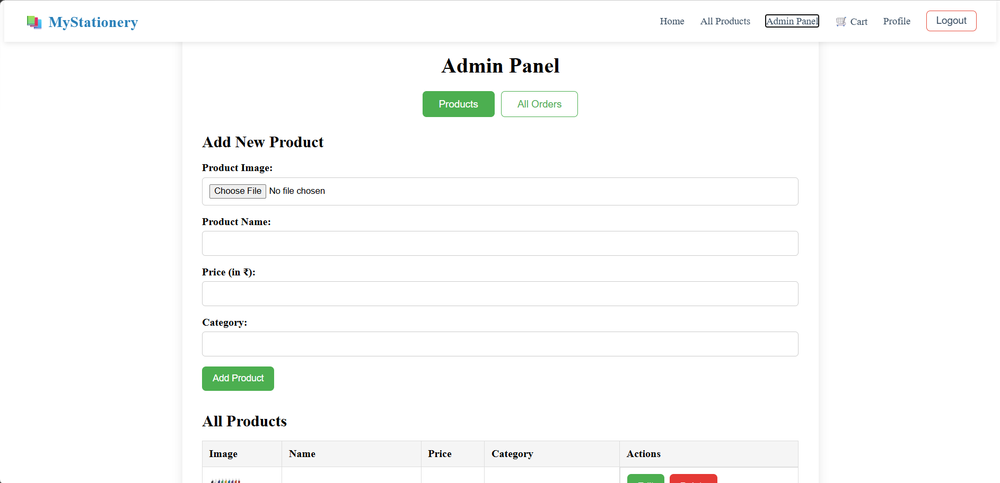

# MyStationery 🛒

### Online Stationary Shop — MERN Stack

A full-stack e-commerce web application built with the MERN stack for purchasing stationary products online. Features complete user authentication, shopping cart, checkout with order placement, and a secure role-based admin panel.

---

## Features

### 👤 User Features

- Register & login with JWT authentication
- Password strength indicator on signup
- Browse all products in a clean responsive grid
- Add to cart, update quantity, remove items
- Checkout with shipping address input
- View past orders in profile

### 🔐 Admin Features

- Separate admin role — hidden from regular users
- Add, edit, and delete products with image upload
- View all customer orders across all users
- Update order status: Placed → Shipped → Delivered

### ⚡ Tech Highlights

- Role-based access control (JWT with role in payload)
- Persistent cart saved to MongoDB (survives page refresh)
- Fully responsive — mobile, tablet, desktop
- Protected admin route (redirects non-admins)

---

## Tech Stack

| Layer    | Technology                                 |
| -------- | ------------------------------------------ |
| Frontend | React.js, React Router, Axios, Context API |
| Backend  | Node.js, Express.js                        |
| Database | MongoDB with Mongoose                      |
| Auth     | JWT (JSON Web Tokens), bcrypt              |
| Styling  | Pure CSS, responsive media queries         |

---

## Getting Started

### Prerequisites

- Node.js v16+
- MongoDB running locally on mongodb://127.0.0.1:27017

### 1. Clone the repo

```bash
git clone https://github.com/YOUR_USERNAME/mystationery.git
cd mystationery
```

### 2. Backend setup

```bash
cd backend
npm install
npm start
```

### 3. Frontend setup (new terminal)

```bash
cd frontend
npm install
npm start
```

Open http://localhost:3000

---

## Login Credentials

| Role  | Email                    | Password  |
| ----- | ------------------------ | --------- |
| Admin | admin@mystationery.com   | Admin@123 |
| User  | Register via Signup page | —         |

---

## Screenshots

### Home Page



### All Products



### Admin Panel



---

## Project Structure

```
mystationery/
├── backend/
│   ├── controllers/      # Business logic
│   ├── middleware/        # JWT auth + admin guard
│   ├── models/            # User, Product, Cart, Order
│   ├── routes/            # API endpoints
│   ├── uploads/           # Product images
│   ├── createAdmin.js     # One-time admin setup
│   └── server.js          # Entry point
└── frontend/
    └── src/
        ├── components/    # Header, Footer, ProductCard, Banner
        ├── context/       # CartContext
        └── pages/         # All page components
```
## Author

**Anjali Mistry**  
B.Tech – Computer Engineering    
LJ University    
[GitHub](https://github.com/AnjaliKMistry)